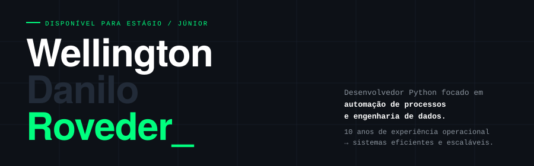

 

---

## 🛠️ Stack

  
  
  
  
  
  
  
  

---

## 🚀 Projetos em Destaque

### 🤖 [FechaBot MVP](https://github.com/Wellington-Roveder/FechaBot-MVP) &nbsp; 

Automação de fechamento diário implantada para cliente real (**Pollo Loko, SJC**).
Substitui processo manual de **20 minutos** por relatório gerado em **30 segundos**.

`Python` `Pandas` `Tkinter` `PyInstaller` `Regex` `Logging`

---

### 📊 [SentinelLog](https://github.com/Wellington-Roveder/SentinelLog-game-price-monitor) &nbsp; 

Pipeline ETL que monitora preços de jogos via API REST, persiste histórico em SQLite e detecta variações automaticamente. Dashboard interativo em Streamlit e alertas via N8N.

`Python` `FastAPI` `SQLite` `N8N` `Streamlit` `ETL`

---

### 🛒 [Django Produtos API](https://github.com/Wellington-Roveder/django-produtos-api) &nbsp; 

API REST CRUD completa com Django REST Framework, testes unitários cobrindo todos os endpoints e boas práticas de segurança com variáveis de ambiente.

`Python` `Django` `DRF` `PostgreSQL` `APITestCase`

---

### 🧬 [Rick & Morty Pipeline](https://github.com/Wellington-Roveder/rick-morty-pipeline) &nbsp; 

Pipeline de extração e formatação de dados da API pública do Rick & Morty com exportação para Excel profissional.

`Python` `Requests` `Pandas` `OpenPyXL`

---

### 🏗️ FechaBot SaaS &nbsp; 

Versão escalável do FechaBot com envio automático via WhatsApp, suporte a múltiplas lojas e dashboard centralizado.

`Python` `Docker` `PostgreSQL` `Redis` `Evolution API`

---

## 📫 Contato

  
  
  

